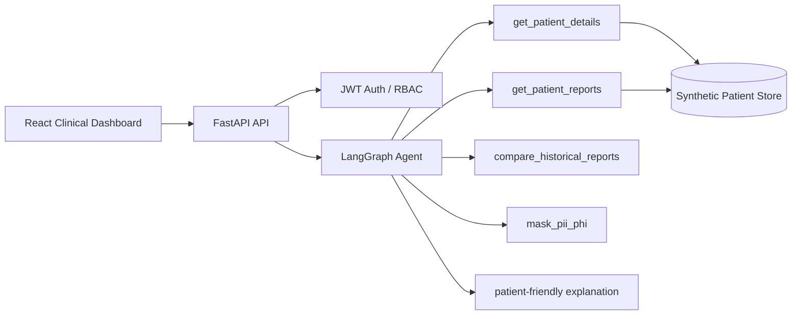

# MedIntel Clinical Workflow AI Agent

A portfolio-grade, synthetic-data healthcare AI assistant demonstrating **LangGraph orchestration, tool calling, patient-scoped retrieval, PHI masking, FastAPI, JWT/RBAC concepts, React, Docker and CI/CD**.

> **Safety:** This repository uses synthetic records only. It is an educational workflow demonstration, not a medical device, diagnosis system, or substitute for clinician judgment.

## Architecture



## Demo flow
1. Login with the synthetic doctor account.
2. Select an MRN.
3. Ask the agent to compare latest vs previous chest X-ray.
4. LangGraph runs deterministic clinical workflow tools.
5. PHI is masked before any external-LLM-ready summary path.
6. UI shows tool execution, clinician summary, patient-friendly explanation and safety disclaimer.

## Demo credentials
- `doctor@medintel.demo` / `doctor123`
- `admin@medintel.demo` / `admin123`

## Run locally
```bash
cd backend
python -m venv .venv && source .venv/bin/activate
pip install -r requirements.txt
uvicorn app.main:app --reload
```

In a second terminal:
```bash
cd frontend
npm install
npm run dev
```

Or use Docker:
```bash
docker compose up --build
```

## API
- `GET /health`
- `POST /auth/login`
- `GET /patients`
- `GET /patients/{mrn}/reports`
- `POST /agent`

## Deployment
`render.yaml` is included for a two-service Render Blueprint deployment. The API uses the backend Dockerfile and the frontend is a Vite static site.

## Resume-ready description
**MedIntel Clinical Workflow AI Agent** — Built and deployed an agentic healthcare workflow using Python, FastAPI, LangGraph and React. Implemented patient-scoped report retrieval, historical radiology comparison, tool-execution tracing, JWT-based authentication, PHI/PII masking, synthetic clinical data, Docker and CI/CD. Designed the application so an external LLM can be configured without exposing raw identifiers.

## Next production-hardening steps
- Replace in-memory users with PostgreSQL and password hashing.
- Enforce patient authorization rules per clinician/tenant.
- Add embeddings + FAISS/Pinecone report-chunk retrieval for larger corpora.
- Route LLM calls through a provider abstraction with structured outputs.
- Add audit logging, encryption, secret management, rate limits and observability.
