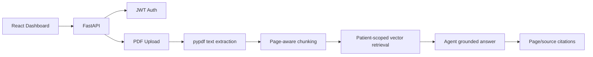

# MedIntel Clinical Workflow AI Agent

A portfolio-grade healthcare AI workflow demo with **PDF RAG, LangGraph orchestration, patient-scoped retrieval, privacy masking, FastAPI, JWT concepts, React, Docker and CI/CD**.

> **Safety:** Use synthetic or de-identified documents only. This is an educational workflow demonstration, not a medical device, diagnosis system, or substitute for clinician judgment.

## PDF RAG flow



## What the demo does
1. Select a synthetic patient/MRN.
2. Upload a text-based PDF up to 10 MB.
3. The backend extracts text page-by-page and splits it into overlapping chunks.
4. Chunks are kept isolated by MRN and ranked against the user's question.
5. Ask questions about the uploaded document.
6. MedIntel returns a grounded extractive answer plus the PDF filename and page references it used.
7. If no PDF has been uploaded, the original synthetic radiology comparison workflow remains available.

Scanned/image-only PDFs currently require OCR and are rejected with a clear message.

## Demo credentials
- `doctor@medintel.demo` / `doctor123`
- `admin@medintel.demo` / `admin123`

## Run locally
```bash
cd backend
python -m venv .venv && source .venv/bin/activate
pip install -r requirements.txt
uvicorn app.main:app --reload
```

In a second terminal:
```bash
cd frontend
npm install
npm run dev
```

## API
- `GET /health`
- `POST /auth/login`
- `GET /patients`
- `GET /patients/{mrn}/reports`
- `GET /patients/{mrn}/documents`
- `POST /patients/{mrn}/documents`
- `POST /agent`

## Deployment note
The free Render demo keeps uploaded PDF chunks in process memory. They can disappear when the backend restarts or sleeps. A production version should persist documents/metadata in object storage + PostgreSQL/vector storage.

## Resume-ready description
**MedIntel Clinical Workflow AI Agent** — Built and deployed a patient-scoped document RAG workflow using Python, FastAPI, LangGraph and React. Added authenticated PDF ingestion, page-aware text extraction/chunking, retrieval-grounded Q&A with source-page citations, privacy masking, synthetic clinical workflows, Docker and CI/CD.

## Production-hardening steps
- Persist uploaded documents in secure object storage and metadata in PostgreSQL.
- Use production embeddings and FAISS/Pinecone/pgvector for semantic retrieval.
- Add OCR for scanned PDFs.
- Enforce tenant/patient authorization and audit logging.
- Route grounded context through a configurable LLM with structured outputs.
